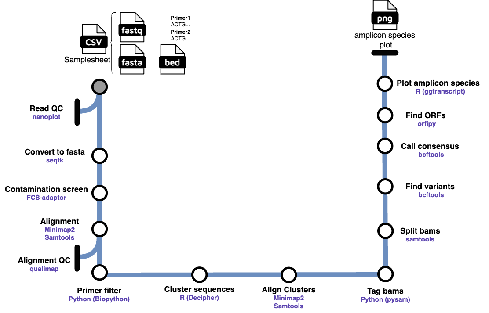

[](https://github.com/rlinder02/rl-hifiampliconanalysis/actions/workflows/ci.yml)
[](https://github.com/rlinder02/rl-hifiampliconanalysis/actions/workflows/linting.yml)[](https://doi.org/10.5281/zenodo.XXXXXXX)
[](https://www.nf-test.com)

[](https://www.nextflow.io/)
[](https://docs.conda.io/en/latest/)
[](https://www.docker.com/)
[](https://sylabs.io/docs/)


## Introduction

**rl/hifiampliconanalysis** is a bioinformatics pipeline that takes amplicon data generated from PacBio HiFi reads, runs quality control on the reads, and aligns the reads to a reference gene and/or cDNA sequence. Reads from different genes should be separated, as the pipeline processes amplicons from a single gene, but can parallelize across multiple different genes. These alignments are then used to cluster reads based on sequence similarity into distinct sub-groups representing the different amplicon species present. Variants are called and a consensus sequence is output (along with a VCF of high confidence variants) for each cluster that pass stringent filtering criteria. A Circos plot is output, showing each different species of amplicon present along with variants and gene structure. A bed file is also output that can be used to contruct images of gene structure by using them as input to [this website](https://gsds.gao-lab.org/index.php). 



1. Read QC ([`Nanoplot`](https://github.com/wdecoster/NanoPlot))
2. Convert fastq to fasta ([`seqtk`](https://github.com/lh3/seqtk))
3. Screen and remove contaminants ([`FCS-adaptor`](https://github.com/ncbi/fcs?tab=readme-ov-file))
4. Alignment ([`Minimap2`](https://github.com/lh3/minimap2), [`samtools`](https://www.htslib.org/))
5. Filter reads without primers ([`Biopython`](https://biopython.org/))
6. Cluster sequences ([`Decipher`](https://bioconductor.org/packages/release/bioc/html/DECIPHER.html))
7. Align clusters ([`Minimap2`](https://github.com/lh3/minimap2), [`samtools`](https://www.htslib.org/))
8. Tag bams ([`pysame`](https://pysam.readthedocs.io/en/stable/))
9. Split bams by cluster ([`samtools`](https://www.htslib.org/))
10. Call variants ([`bcftools`](https://samtools.github.io/bcftools/bcftools.html))
11. Call consensus sequences ([`bcftools`](https://samtools.github.io/bcftools/bcftools.html))
12. Find the longest ORF ([`orfipy`](https://github.com/urmi-21/orfipy))
13. Plot amplicon species (['circlize'](https://jokergoo.github.io/circlize_book/book/))
14. Plot gene structure of each species ([`gsds`](https://gsds.gao-lab.org/index.php))

## Usage

> [!NOTE]
> If you are new to Nextflow and nf-core, please refer to [this page](https://nf-co.re/docs/usage/installation) on how to set-up Nextflow. Make sure to [test your setup](https://nf-co.re/docs/usage/introduction#how-to-run-a-pipeline) with `-profile test` before running the workflow on actual data.

First, prepare a samplesheet in the `assets` folder with your input data that looks as follows, ensuring that the necessary files are placed in a `data/` folder:

`samplesheet.csv`:

```csv
sample,fastq,fasta,primer1,primer2,bed
sample1,data/sample1.fastq.gz,data/reference.fasta,ACTG...,ACTG...,data/reference.bed
```

Each row represents a fastq file (PacBio HiFi), a gene reference file, the sequences of the gene-specific primers used for amplification, and a bed file that has the chromosome and positions of the gene features of interest (introns/exons/UTRs, etc...). The bed file should be derived from the same gene/cDNA sequence as the reference fasta and can be obtained by navigating to the UCSC genome browser, searching for the gene of interest, clicking the Tools dropdown, going to the Table Browser, then selecting the region of interest along with the knownGene table, selecting BED as the output format, select Get output, then selecting and downloading each feature you are interested in, followed by collating all features into a single BED file.

Now, you can run the pipeline using:

<!-- TODO nf-core: update the following command to include all required parameters for a minimal example -->

```bash
nextflow run rlinder02/rl-hifiampliconanalysis \
   -r v1.0.0
   -profile <docker/singularity/.../institute> \
   --input assets/samplesheet.csv \
   --outdir <OUTDIR>
```

> [!WARNING]
> Please provide pipeline parameters via the CLI or Nextflow `-params-file` option. Custom config files including those provided by the `-c` Nextflow option can be used to provide any configuration _**except for parameters**_;
> see [docs](https://nf-co.re/usage/configuration#custom-configuration-files).

## Credits

rlinder02/rl-hifiampliconanalysis was originally written by Rob Linder.

## Contributions and Support

If you would like to contribute to this pipeline, please see the [contributing guidelines](.github/CONTRIBUTING.md).

## Citations

An extensive list of references for the tools used by the pipeline can be found in the [`CITATIONS.md`](CITATIONS.md) file.

This pipeline uses code and infrastructure developed and maintained by the [nf-core](https://nf-co.re) community, reused here under the [MIT license](https://github.com/nf-core/tools/blob/master/LICENSE).

> **The nf-core framework for community-curated bioinformatics pipelines.**
>
> Philip Ewels, Alexander Peltzer, Sven Fillinger, Harshil Patel, Johannes Alneberg, Andreas Wilm, Maxime Ulysse Garcia, Paolo Di Tommaso & Sven Nahnsen.
>
> _Nat Biotechnol._ 2020 Feb 13. doi: [10.1038/s41587-020-0439-x](https://dx.doi.org/10.1038/s41587-020-0439-x).
